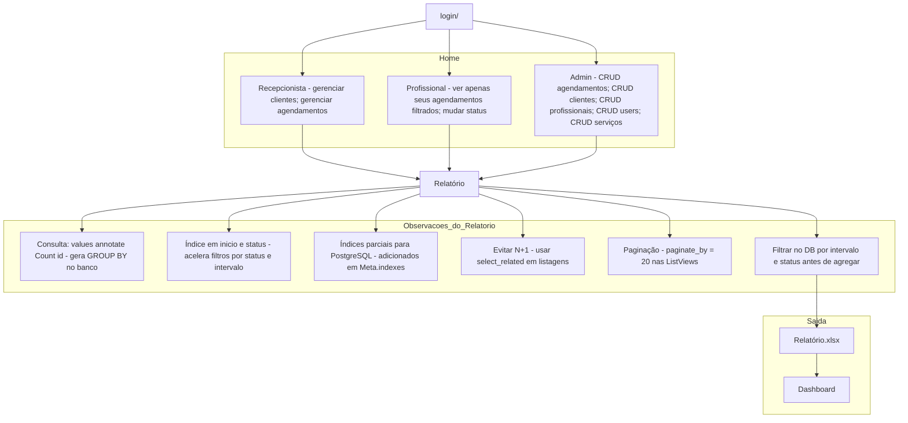

# 💇‍♀️ Sistema de Agendamento para Salão de Beleza

[](https://www.djangoproject.com/)
[](https://www.python.org/)
[](https://pandas.pydata.org/)
[](https://python-poetry.org/)
[](https://getbootstrap.com/)

Sistema de agendamento desenvolvido em **Django** para gestão de clientes, serviços e profissionais em um salão de beleza, com **controle de acesso por grupos**, **relatórios rápidos** e **integração com dashboard interativo**.

---

## 📑 Índice
1. [Arquitetura do Projeto](#arquitetura-do-projeto)
2. [Fluxograma](#fluxograma)
3. [Funcionalidades](#funcionalidades)
4. [Usuários e Acessos](#usuários-e-acessos)
5. [Relatórios e Performance](#relatórios-e-performance)
6. [Como Rodar o Projeto](#como-rodar-o-projeto)
7. [Comandos Adicionais](#comandos-adicionais)
8. [Licença](#licença)

---

## 🏗 Arquitetura do Projeto
- **Backend:** Django 4+ com Python 3.10+
- **Frontend:** HTML, CSS, Bootstrap 5
- **Banco de Dados:** PostgreSQL
- **Bibliotecas:** Pandas, Poetry
- **Controle de Acesso:** Grupos e permissões do Django
- **Relatórios:** Exportação para Excel + integração com dashboard externo

---

## 📊 Fluxograma


## ⚙️ Funcionalidades
- **CRUD** Serviços, Usuários e Profissionais (restrito ao admin)
- Página inicial adaptada ao perfil do usuário:
  - **Profissional:** apenas seus agendamentos
  - **Recepcionista:** Gerenciar agendamentos e clientes
- Controle de permissões via grupos:
  - **Dono (admin)**
  - **Profissional**
  - **Recepcionista**

---

## 👥 Usuários e Acessos

| Grupo         | Usuário         | Senha     | Permissões principais |
|---------------|-----------------|-----------|----------------------|
| Admin         | rafael          | 1234      | CRUD completo e gestão de usuários |
| Profissional  | profissional1   | profi123  | Ver seus agendamentos, mudar status |
| Profissional  | profissional2   | profi123  | Ver seus agendamentos, mudar status |
| Profissional  | profissional3   | profi123  | Ver seus agendamentos, mudar status |
| Recepcionista | recepcionista   | recep123  | Gerenciar clientes e agendamentos  |

---

## 💅 Serviços cadastrados
- Hidratação
- Corte
- Manicure
- Massoterapia
- Design de sobrancelha

---

## 📈 Relatórios e Performance

**Relatórios:**
- Filtrados por período e status
- Exportação para Excel (detalhado)
- Link para aplicação de dashboard interativo com insights
[Link aplicação](https://dashbord-relatorio-salao.streamlit.app/)
**Otimizações:**
- `values().annotate(Count('id'))` → GROUP BY no banco
- Índices em `inicio` e `status` → filtros instantâneos
- Índices parciais no PostgreSQL para `status='CONCLUIDO'`
- Uso de `select_related()` para evitar N+1 queries
- Paginação (`paginate_by=20`)

---

# 🚀 Como rodar o projeto

```bash
git clone https://github.com/Rafael-Levi/desafio_sistema_salao.git
```
### Caso não tenha poetry instalado
```bash
pip install poetry
```
### Criar ambiente virtual
```bash
poetry install
```
### Entrar no ambiente virtual
```bash
poetry shell 
```
### Roda aplicação
```bash
task run
```


# 🔧 Outros comandos:
### Iniciar e migrations banco de dados 
```bash
task init_db
```
### Criar usuário admin (superuser)
```bash
task criar_admin
```
---
```graphql
desafio_salao/
└── desafio_salao
    ├── README.md                          # Documentação principal do projeto
    ├── core/
    │   ├── __init__.py
    │   ├── asgi.py                         # Configuração ASGI do Django
    │   ├── settings.py                     # Configurações globais do projeto
    │   ├── urls.py                         # Mapeamento global de URLs
    │   └── wsgi.py                         # Configuração WSGI do Django
    ├── db.sqlite3                          # Banco de dados SQLite local
    ├── manage.py                           # Script de gerenciamento do Django
    ├── pyproject.toml                      # Configuração do ambiente Python
    └── salao/
        ├── __init__.py
        ├── admin.py                        # Registro de modelos no Django Admin
        ├── apps.py                         # Configuração da aplicação "salao"
        ├── forms/
        │   ├── agendamento_form.py         # Formulário para agendamento
        │   ├── cliente_form.py              # Formulário para cliente
        │   └── relatorio_form.py            # Formulário para relatórios
        ├── management/
        │   └── commands/
        │       └── sync_professional_groups.py  # Comando customizado para sincronizar grupos de profissionais
        ├── migrations/
        │   ├── 0001_initial.py              # Migração inicial do banco
        │   └── __init__.py
        ├── models/
        │   ├── agendamento.py               # Modelo de agendamento
        │   ├── cliente.py                   # Modelo de cliente
        │   ├── profissional.py              # Modelo de profissional
        │   └── servico.py                   # Modelo de serviço
        ├── reports.py                       # Relatórios do sistema
        ├── routers/
        │   ├── agendamento_urls.py          # Rotas de agendamento
        │   ├── cliente_urls.py              # Rotas de cliente
        │   ├── login_urls.py                # Rotas de login
        │   └── relatorio_urls.py            # Rotas de relatórios
        ├── signals.py                       # Configuração de signals (gatilhos)
        ├── templates/
        │   ├── agendamentos/
        │   │   ├── agendamento_confirm_delete.html
        │   │   ├── agendamento_detail.html
        │   │   ├── agendamento_form.html
        │   │   └── agendamento_list.html
        │   ├── base.html
        │   ├── clientes/
        │   │   ├── cliente_form.html
        │   │   └── clientes_list.html
        │   ├── home/
        │   │   ├── home_default.html
        │   │   ├── home_profissional.html
        │   │   └── home_recepcionista.html
        │   ├── login/
        │   │   └── login.html
        │   └── relatorio/
        │       └── relatorio_servicos.html
        ├── tests.py                         # Testes automatizados
        └── views/
            ├── cliente_view.py              # Lógica de visualização de clientes
            ├── home_view.py                 # Lógica de visualização da home
            └── relatorio_view.py            # Lógica de visualização de relatórios
```
