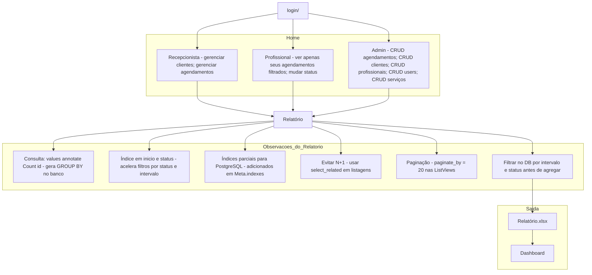

```mermaid
graph TD
    A[login/] --> B[Recepcionista - gerenciar clientes; gerenciar agendamentos]
    A --> C[Profissional - ver apenas seus agendamentos filtrados; mudar status]
    A --> D[Admin - CRUD agendamentos; CRUD clientes; CRUD profissionais; CRUD users; CRUD serviços]

    B --> E[Relatório]
    C --> E
    D --> E

    E --> E1[Consulta: values annotate Count id - gera GROUP BY no banco]
    E --> E2[Índice em inicio e status - acelera filtros por status e intervalo]
    E --> E3[Índices parciais para PostgreSQL - adicionados em Meta.indexes]
    E --> E4[Evitar N+1 - usar select_related em listagens]
    E --> E5[Paginação - paginate_by = 20 nas ListViews]
    E --> E6[Filtrar no DB por intervalo e status antes de agregar]

    E6 --> F[Relatório.xlsx]
    F --> G[Dashboard]

    subgraph Home
        B
        C
        D
    end

    subgraph Observacoes_do_Relatorio
        E1
        E2
        E3
        E4
        E5
        E6
    end

    subgraph Saida
        F
        G
    end


```
